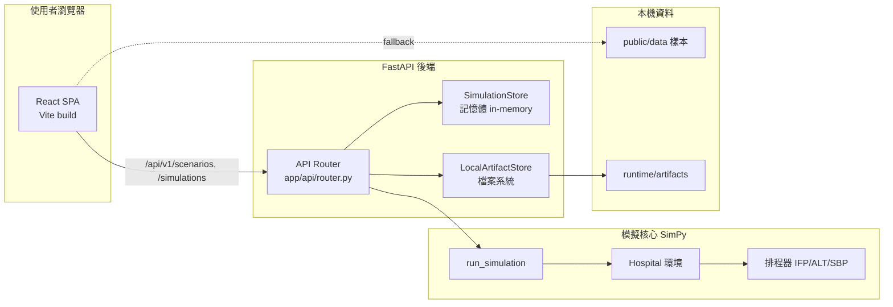
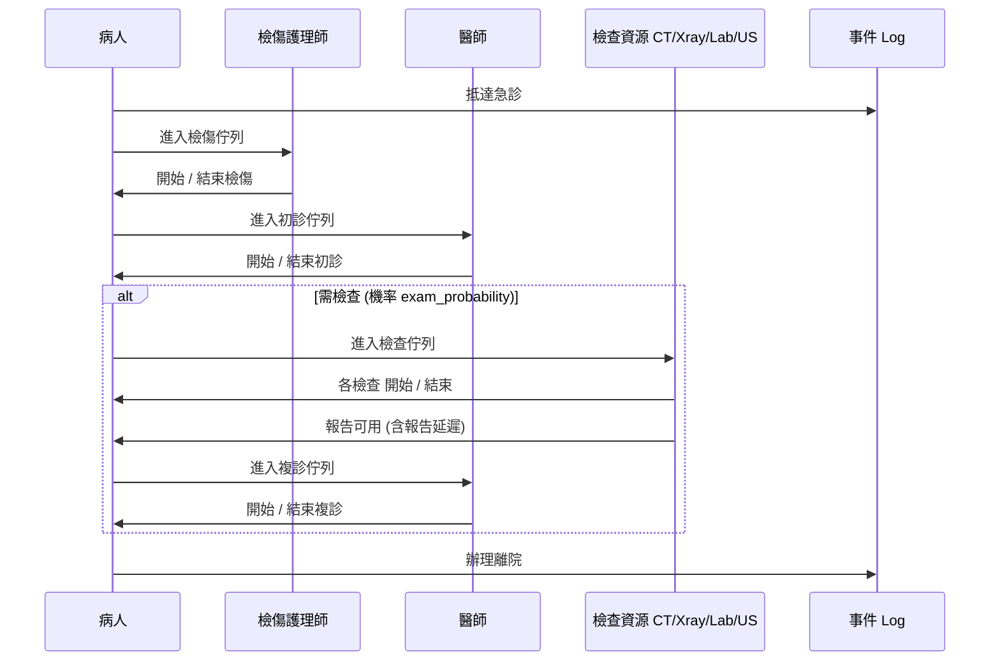

# 急診模擬系統 大綱書

## 1. 專題簡介

本專題以離散事件模擬（Discrete Event Simulation, DES）為核心，建構一套急診室（Emergency Department, ED）流程模擬系統，模擬病人從到院、檢傷、初診、檢查到複診離院的完整路徑，並針對醫師排程策略與資源配置進行可調式情境分析。

整體系統採前後端分離設計：

- **模擬核心**：以 Python 的 [SimPy](https://simpy.readthedocs.io/) 為基礎，於 [`simulation-service/simulation_core/`](simulation-service/simulation_core/) 中實作病人流程、資源佔用、醫師班表與排程邏輯。
- **後端服務**：以 [FastAPI](https://fastapi.tiangolo.com/) 包裝模擬核心，提供 RESTful API 與下載用 artifact，程式位於 [`simulation-service/app/`](simulation-service/app/)。
- **前端控制台**：以 React 19 + Vite 建構的 SPA 介面，位於 [`frontend/`](frontend/)，提供情境選擇、即時模擬、結果摘要、事件明細表與論文/公式參考頁。
- **部署封裝**：以 Docker / Docker Compose 提供本機正式與開發兩種啟動模式（[`docker-compose.yml`](docker-compose.yml)、[`docker-compose.dev.yml`](docker-compose.dev.yml)），並備有 Cloud Run / Render / Railway / Cloudflare Pages 的部署配方（[`docs/deployment.md`](docs/deployment.md)）。

此大綱書整理目前已完成的內容，作為老師審閱本專題實作進度的依據。

## 2. 研究動機

急診室的擁塞、等候時間過長與檢傷後延遲處置，已是全球許多急診部門共同的營運壓力。實際醫院難以直接以病人安全為代價進行資源配置實驗，因此「以模擬替代試誤」成為近年急診管理研究的主要方法。本專題的研究動機可歸納為三點：

1. **病人流的可量化評估**：透過事件記錄（event log），量化平均等待時間、P95 等候、資源使用率等指標，協助管理者了解瓶頸。
2. **資源配置的情境試算**：在模擬中調整醫師、護理師、CT、X 光、超音波、檢驗等資源的數量與班表，觀察對等候時間的影響。
3. **排程策略的橫向比較**：相同病人到診序列下，比較「初診優先（IFP）」、「初複診交替（ALT）」、「以等候裕度為基礎（Slack-Based Priority, SBP）」等排程策略對指標的影響。

本專題參考了 repo 內附的四篇急診模擬與最佳化文獻：

- *An Agent-Based Architecture of the Digital Twin for an Emergency Department*
- *Discrete Event Simulation-Based Analysis and Optimization of Emergency Department*
- *Enhancing Patient Flow in Emergency Departments: A Machine Learning approach*
- *Optimizing Emergency Department Operations: A Simulation-based approach*

其中關於 NHPP（Non-Homogeneous Poisson Process）到診率與檢傷時間分配等核心建模設定，係依據前述文獻中所提供的每週每小時到診率表（即程式中 [`PAPER_ARRIVAL_RATES_BY_DAY`](simulation-service/simulation_core/defaults.py)）與檢傷三角分配實作。

## 3. 系統架構

### 3.1 元件總覽

整體系統依職責拆成四層：前端展示層、後端服務層、模擬核心層、與檔案產出層。前端可在 API 不可用時自動退回 `public/data/` 中的樣本結果，因此即使後端尚未啟動，畫面仍能呈現完整的情境資料（fallback 機制位於 [`frontend/src/lib/api.js`](frontend/src/lib/api.js)）。

### 3.2 執行流程

依 [`docs/architecture.md`](docs/architecture.md) 所述，系統的執行流程如下：

1. 前端載入時呼叫 `GET /api/v1/scenarios` 取得情境清單，若失敗則改讀 `public/data/scenarios.json`。
2. 使用者於前端表單調整參數後，按下「執行模擬」送出 `POST /api/v1/simulations`。
3. 後端 API 將請求轉為 [`SimulationParameters`](simulation-service/simulation_core/models.py) dataclass，呼叫 `simulation_core.run_simulation()`。
4. 模擬核心於 SimPy 環境中跑完整個情境，回傳結果 dataclass。
5. API 透過 [`LocalArtifactStore`](simulation-service/app/services/artifact_store.py) 將 `result.json`、`event_log.{json,csv}`、`patient_summary.{json,csv}` 寫入 `.runtime/artifacts/<simulation_id>/`。
6. 前端立即顯示模擬摘要與事件明細，並提供下載連結至各 artifact。

## 4. 模擬核心模型

模擬核心位於 [`simulation-service/simulation_core/`](simulation-service/simulation_core/)，包含五個檔案：[`models.py`](simulation-service/simulation_core/models.py)（資料結構）、[`defaults.py`](simulation-service/simulation_core/defaults.py)（論文預設與事件名稱）、[`hospital_env.py`](simulation-service/simulation_core/hospital_env.py)（資源環境）、[`scheduler.py`](simulation-service/simulation_core/scheduler.py)（排程策略）、[`simulation.py`](simulation-service/simulation_core/simulation.py)（事件迴圈與病人流程）。

### 4.1 病人到診模型（NHPP）

到診過程採非齊次卜瓦松過程（Non-Homogeneous Poisson Process, NHPP）。每小時 \(h\)、每星期 \(d\) 的到診率為：

\[ \lambda_{d,h} = \lambda^{paper}_{d,h} \cdot \alpha \]

其中 \(\lambda^{paper}_{d,h}\) 為論文 Table 2 提供的每週 168 小時到診率（程式中常數 [`PAPER_ARRIVAL_RATES_BY_DAY`](simulation-service/simulation_core/defaults.py)），\(\alpha\) 為前端可調的 `arrival_rate_multiplier`，用於模擬高峰加成或低載情境。

每小時的到診人數依 Poisson 分配抽樣：

\[ N_{d,h} \sim \text{Poisson}(\lambda_{d,h}) \]

到診時刻在小時內以均勻分配灑點。實作見 [`simulation.py`](simulation-service/simulation_core/simulation.py) 的 `patient_arrival()` 與 `sample_poisson()` 函式。

### 4.2 病人流程（Patient Flow）

每位病人到院後依下列序列流動：到診 → 檢傷佇列 → 開始/結束檢傷 → 進入初診佇列 → 開始/結束初診 → （依機率）進入檢查佇列、執行 CT/Xray/Lab/Ultrasound 並等待報告 → 進入複診佇列 → 開始/結束複診 → 辦理離院。

實作位於 [`simulation.py`](simulation-service/simulation_core/simulation.py) 的 `patient_flow()`，每個事件均寫入 [`PatientRecord.record_event()`](simulation-service/simulation_core/models.py)，並於模擬結束後合併、排序、補上每位病人的等候/在院時間欄位（`enrich_event_log()`）。

### 4.3 資源建模

資源以 SimPy 的 `simpy.Resource` 包裝，於 [`hospital_env.py`](simulation-service/simulation_core/hospital_env.py) 的 `Hospital` 類別建立：

| 資源         | 容量參數                                | 是否分時段 | 說明                          |
| ---------- | ----------------------------------- | ----- | --------------------------- |
| 醫師         | `num_doctors` / `num_doctors_night` | 是     | 07:00–22:00 為白班，其餘時段為夜班     |
| 護理師        | `num_nurses`                        | 否     | 處理檢傷流程                      |
| CT         | `num_ct`                            | 否     | 容量 \(C_{CT}(t) = n_{CT}\)   |
| Xray       | `num_xray`                          | 否     | 容量 \(C_{XR}(t) = n_{XR}\)   |
| Lab        | `num_lab`                           | 否     | 容量 \(C_{Lab}(t) = n_{Lab}\) |
| Ultrasound | `num_ultrasound`                    | 否     | 容量 \(C_{US}(t) = n_{US}\)   |

醫師為分段函數：

\[ D(t) = \begin{cases} n_d^{day}, & 07{:}00 \le (t \bmod 1440) < 22{:}00 \\ n_d^{night}, & \text{otherwise} \end{cases} \]

醫師工作以 worker pattern 表示——每位醫師為一個 `doctor_worker` process，輪流自佇列取下一位請求；當班表切換時 worker 會自動進入或離開值班，相關邏輯位於 [`SimulationParameters.is_doctor_active()`](simulation-service/simulation_core/models.py) 與 `simulation.py` 的 `doctor_worker()`。資源忙碌時間統計於 `Hospital.busy_time` 中累加，並用於後續使用率計算。

### 4.4 排程策略

醫師佇列被拆成三個獨立 deque：「Level III 初診佇列」、「Level IV 初診佇列」、「複診佇列」。三種策略均位於 [`scheduler.py`](simulation-service/simulation_core/scheduler.py)：

- **IFP (Initial First Priority)**：初診優先，初診中再以 Level III > Level IV 排序。
- **ALT (Alternating)**：初診與複診交替，避免複診長期被壓在初診之後。
- **SBP (Slack-Based Priority)**：以「等候裕度」決定是否優先處理初診；當初診請求的等候時間已逼近目標時間 `target_time_levelX − k_levelX` 時視為緊急，否則先處理複診。預設參數：`target_time_level3 = 30 min`、`target_time_level4 = 120 min`、`k_level3 = 13.1`、`k_level4 = 2.1`，皆可由 API 覆寫。

### 4.5 機率分布

| 階段       | 分配                    | 參數（分鐘）                       |
| -------- | --------------------- | ---------------------------- |
| 檢傷時間     | Triangular            | min = 3, mode = 7, max = 10  |
| 初診服務     | Truncated Exponential | mean = 9, min = 5, max = 15  |
| 複診服務     | Truncated Exponential | mean = 15, min = 5, max = 25 |
| CT 持續時間  | 常數                    | 2.45（報告延遲 30）                |
| X 光持續時間  | 常數                    | 3.99（報告延遲 30）                |
| Lab 持續時間 | 常數                    | 1.19（報告延遲 20）                |
| 超音波持續時間  | 常數                    | 6.58（報告延遲 0）                 |

### 1. Triangular (三角分配)：檢傷時間

- **設定值**：最少 3 分鐘、最常發生 7 分鐘、最多 10 分鐘。

- **白話解釋**：當我們對某個流程缺乏非常龐大的歷史精確數據，但有明確的「經驗法則」時，最適合用三角分配。護理師做檢傷分類，再怎麼快也要問基本病史跟量血壓（最少 3 分鐘），遇到比較複雜的病人可能會花比較久（最多 10 分鐘），但「絕大多數」的病人大概都會落在 7 分鐘左右。這在圖形上就像一個頂點在 7 的三角形。在程式中，這是透過 `rng.triangular()` 函數來模擬的。

### 2. Truncated Exponential (截斷指數分配)：初診與複診服務

- **初診設定值**：平均 9 分鐘，範圍限制在 5 到 15 分鐘。

- **複診設定值**：平均 15 分鐘，範圍限制在 5 到 25 分鐘。

- **白話解釋**：「指數分配」常被用來模擬服務時間，它的特性是「大部分的服務時間都不長，但有極少數的服務會拖非常非常久」。

- **為什麼要「截斷 (Truncated)」？** 在純數學的指數分配裡，時間有可能趨近於 0 分鐘，也有可能算出 1000 分鐘，但這在真實的醫院是不合理的。所以系統加上了「截斷」的條件：強制把初診時間限制在最少 5 分鐘、最多 15 分鐘內，避免模擬系統跑出「看診 1 秒鐘」或「看診 3 天」這種極端錯誤，這樣跑出來的流程時間才會符合真實臨床情境。

每位病人是否需要檢查由 `exam_probability`（預設 0.6）決定；若需檢查，再依各設備本身的機率（如 Lab 0.92、CT 0.55、Xray 0.29、Ultrasound 0.22）獨立決定是否進行該項檢查。檢傷分級採 Level III / Level IV 依 25% / 75% 抽樣（[`DEFAULT_LEVEL3_SHARE`](simulation-service/simulation_core/defaults.py)）。

## 5. 系統功能

### 5.1 後端 API

依 [`docs/api.md`](docs/api.md) 與 [`app/api/router.py`](simulation-service/app/api/router.py)，目前已開放下列端點：

| 方法   | 路徑                                          | 功能                           |
| ---- | ------------------------------------------- | ---------------------------- |
| GET  | `/api/v1/health`                            | 健康檢查，回傳 `{ "status": "ok" }` |
| GET  | `/api/v1/scenarios`                         | 取得預設情境清單（與前端共享）              |
| POST | `/api/v1/simulations`                       | 接收參數 → 執行模擬 → 回傳完整結果         |
| GET  | `/api/v1/simulations/{id}`                  | 取得模擬 metadata 與 artifact URL |
| GET  | `/api/v1/simulations/{id}/result`           | 取得已存的完整結果 payload            |
| GET  | `/api/v1/simulations/{id}/artifacts/{name}` | 下載特定 artifact 檔              |

請求與回應結構由 Pydantic 模型保證型別正確，定義於 [`app/schemas/simulation.py`](simulation-service/app/schemas/simulation.py)。完整 API 合約另行存放於 [`shared/contracts/simulation-contract.json`](shared/contracts/simulation-contract.json)，方便前後端對齊。

### 5.2 模擬產出（Artifacts）

每次成功的模擬都會產生五份檔案，由 [`LocalArtifactStore`](simulation-service/app/services/artifact_store.py) 寫入 `.runtime/artifacts/<simulation_id>/`：

- `result.json`：完整回傳 payload，含參數、摘要、事件 log 與病人摘要。
- `event_log.json` / `event_log.csv`：事件層級的明細（CSV 含 UTF-8 BOM 以利 Excel 開啟）。
- `patient_summary.json` / `patient_summary.csv`：以病人為單位的等候/在院時間摘要。

匯出邏輯（CSV 寫法、JSON 序列化）集中在 [`simulation.py`](simulation-service/simulation_core/simulation.py) 的 `export_result()`，避免模擬核心耦合特定儲存裝置。

### 5.3 預設情境

於 [`defaults.py`](simulation-service/simulation_core/defaults.py) 的 `DEFAULT_SCENARIOS` 中定義四組情境：

| Slug                | 標題                | 用途                            |
| ------------------- | ----------------- | ----------------------------- |
| `weekly-baseline`   | Weekly Baseline   | 一週 NHPP 完整跑（10 080 分鐘），對齊論文預設 |
| `baseline`          | Baseline          | 12 小時短跑，快速驗證單日流程              |
| `surge`             | Surge Load        | 到診率乘 1.15，觀察高壓需求              |
| `expanded-staffing` | Expanded Staffing | 白班 6 / 夜班 4 醫師，觀察擴編效果         |

對應的樣本結果存於 [`data/samples/`](data/samples/) 與 [`frontend/public/data/`](frontend/public/data/)，以便前端在無 API 時仍能展示。

### 5.4 前端控制台

前端以 [`frontend/src/app/App.jsx`](frontend/src/app/App.jsx) 為主畫面，含三個分頁切換：

1. **模擬總覽**：左欄為情境選擇器（[`ScenarioSelector.jsx`](frontend/src/features/simulation/components/ScenarioSelector.jsx)）與即時模擬表單（[`SimulationForm.jsx`](frontend/src/features/simulation/components/SimulationForm.jsx)，可調 12 個欄位）；右欄為摘要面板（[`ResultSummary.jsx`](frontend/src/features/results/components/ResultSummary.jsx)）顯示六個關鍵指標、資源使用率條、artifact 下載連結。下方為事件明細表（[`EventLogTable.jsx`](frontend/src/features/results/components/EventLogTable.jsx)），支援關鍵字搜尋、星期篩選、事件分類（到離院 / 檢傷 / 初診 / 檢查 / 複診）與事件名稱多重過濾。
2. **論文參考**：[`ArrivalRateReferenceTable.jsx`](frontend/src/features/results/components/ArrivalRateReferenceTable.jsx) 將論文 Table 2 的每週 24 小時到診率以表格呈現。
3. **模型公式**：[`ModelFormulaReference.jsx`](frontend/src/features/results/components/ModelFormulaReference.jsx) 整理固定容量函數、醫師分段班表、NHPP 到診率與三組機率分布，方便對照簡報、論文與程式實作。

時間相關格式（模擬時刻 → 第 N 週 週X HH:MM、Duration → 天/小時/分）統一透過 [`formatters.js`](frontend/src/lib/formatters.js) 處理。

### 5.5 Live / Sample 雙模式 fallback

為避免 API 尚未部署或暫時離線時整個前端無法操作，[`frontend/src/lib/api.js`](frontend/src/lib/api.js) 在 `fetchScenarios()` 內建 try / fallback：先打 `${VITE_API_BASE_URL}/api/v1/scenarios`，失敗即改讀 `public/data/scenarios.json`，並把 `source` 標示為 `sample`。即時模擬若失敗，畫面會自動退回所選情境的樣本結果並以 StatusBanner 提示使用者，邏輯位於 `App.jsx` 的 `handleRunSimulation()`。

### 5.6 CLI 樣本生成

[`simulation-service/scripts/run_cli.py`](simulation-service/scripts/run_cli.py) 提供命令列入口，可指定情境或單獨覆寫某些參數，將五份 artifact 直接輸出到 `data/samples/<scenario>/`，可用於離線重建前端的樣本檔。專案根目錄的 [`main.py`](main.py) 為 thin wrapper，方便直接 `python main.py` 呼叫。

### 5.7 Docker 部署

提供兩種啟動模式（細節見 [`docs/docker.md`](docs/docker.md)）：

- **正式模擬模式**：`docker compose up --build`，前端先 build 後由 Nginx 提供，並反向代理 `/api/` 至 backend 容器。
- **開發模式**：`docker compose -f docker-compose.yml -f docker-compose.dev.yml up --build`，前端使用 Vite dev server 支援熱更新。

另提供 Windows 友善的 PowerShell 腳本（[`docker/up.ps1`](docker/up.ps1)、[`docker/up-dev.ps1`](docker/up-dev.ps1)、[`docker/down.ps1`](docker/down.ps1)），規避 BuildKit 在中文/特殊路徑下偶發的 build 錯誤。

## 6. 已實作的指標

完整的摘要結構由 [`SimulationSummaryResponse`](simulation-service/app/schemas/simulation.py) 與 [`build_summary()`](simulation-service/simulation_core/simulation.py) 產生：

| 指標                                                 | 含義                   |
| -------------------------------------------------- | -------------------- |
| `total_patients`                                   | 模擬期間累計到診人數           |
| `total_events`                                     | 全部事件 log 筆數          |
| `average_waiting_time`                             | 平均初診等待（到院 → 開始初診）    |
| `p95_waiting_time`                                 | 第 95 百分位的初診等待時間      |
| `average_time_in_system`                           | 平均在院時間（到院 → 離院）      |
| `average_service_time`                             | 平均初診後流程時間（開始初診 → 離院） |
| `resource_utilization.doctors`                     | 醫師利用率（考慮分段班表的有效容量分鐘） |
| `resource_utilization.nurses`                      | 護理師利用率               |
| `resource_utilization.{ct, xray, lab, ultrasound}` | 各檢查設備利用率             |

每位病人也會輸出 `waiting_time`、`follow_up_waiting_time`、`total_waiting_time`、`service_time`、`time_in_system`、`enter_facility_clock`、`departure_clock` 等欄位，方便前端依事件 log 直接顯示。

## 7. 使用技術

### 7.1 後端

- **Python 3.12+**
- **FastAPI**（>=0.115）：提供 ASGI Web 服務、依賴注入、Pydantic 整合
- **SimPy**（>=4.1）：離散事件模擬框架
- **uvicorn**：ASGI server
- **pytest** + **httpx**：測試框架（見 [`requirements-dev.txt`](simulation-service/requirements-dev.txt)）

依賴設定見 [`simulation-service/requirements.txt`](simulation-service/requirements.txt)。

### 7.2 前端

- **React 19** + **Vite 8**
- **ESLint 9**：搭配 `eslint-plugin-react-hooks`、`eslint-plugin-react-refresh`

完整版本見 [`frontend/package.json`](frontend/package.json)。

### 7.3 容器與部署

- **Docker / Docker Compose**：本機正式模擬模式與開發模式（[`docker-compose.yml`](docker-compose.yml)、[`docker-compose.dev.yml`](docker-compose.dev.yml)）
- **Nginx**：在正式模擬模式下擔任前端靜態資源伺服器與 `/api/` 反向代理（[`docker/nginx/`](docker/nginx/)）
- **雲端配方**：Cloud Run、Render、Railway（後端）；Cloudflare Pages（前端），逐項列於 [`docs/deployment.md`](docs/deployment.md)。

## 8. 測試與驗證

`pytest` 測試集中於 [`simulation-service/tests/`](simulation-service/tests/)，目前涵蓋下列八個關鍵驗證點：

| 測試                                                   | 驗證內容                                                                 |
| ---------------------------------------------------- | -------------------------------------------------------------------- |
| `test_healthcheck`                                   | `GET /api/v1/health` 回傳 `{ "status": "ok" }`                         |
| `test_create_simulation_returns_result`              | `POST /api/v1/simulations` 完成後回傳 `status=completed`、含病人摘要與 event_log |
| `test_create_app_reads_artifact_root_from_env`       | `SIMULATION_ARTIFACT_ROOT` 環境變數能正確被 settings 讀入                      |
| `test_run_simulation_returns_records`                | 模擬有產生病人、事件第一筆為「抵達急診」、病人摘要含等候欄位                                       |
| `test_doctor_shift_schedule_matches_paper`           | 醫師班表在 00:00 / 07:00 / 22:00 切換、24 小時容量分鐘為 6 120（= 5×15h + 3×9h）      |
| `test_export_result_supports_json_and_csv`           | `result.json` 為 dict、`event_log.csv` 為含 BOM 的 bytes                  |
| `test_patient_cohort_stays_stable_across_strategies` | 同 seed 下 SBP 與 ALT 的病人 cohort（id、檢傷分級、到診時刻）完全一致，可用於策略比較              |
| `test_triage_events_happen_before_initial_consult`   | 每位病人事件序列必為「進入檢傷佇列 → 開始檢傷 → 結束檢傷 → 開始初診」                              |

執行方式：在 `simulation-service/` 下 `pytest`，或於整個 repo 使用 `python -m pytest simulation-service`。

## 9. 目前成果

依目前 repo 實作可達成的事項：

1. **完整跑完一週 NHPP 情境**：以 `weekly-baseline`（10 080 分鐘）情境執行模擬，並輸出超過 19 MB 的 `result.json` 與五份 artifact（樣本見 [`data/samples/weekly-baseline/`](data/samples/weekly-baseline/)）。
2. **可在前端切換情境並查看摘要**：`baseline`、`surge`、`expanded-staffing` 等情境提供樣本結果，使用者可在不啟動 backend 的情況下檢視畫面流。
3. **可送出即時模擬請求**：FastAPI 接到請求後執行 SimPy 模擬，回傳完整 payload 並提供五份 artifact 下載。
4. **可比較三種排程策略**：因相同隨機種子下病人 cohort 一致，使用者可分別以 SBP / ALT / IFP 跑同一情境並比對等候時間與資源利用率。
5. **可調 12 個前端欄位**：排程策略、白班/夜班醫師、護理師、CT、Xray、Lab、Ultrasound、模擬分鐘、檢查比例、到診倍率、隨機種子。
6. **可在 Docker 一鍵啟動**：`docker compose up --build` 即可同時啟動 backend 與 frontend，並透過 healthcheck 串接啟動順序；artifact 會落在主機端 `data/runtime/artifacts/`。
7. **可在三個分頁中查閱論文參考與模型公式**：方便老師審閱模型對齊論文的程度，並比對程式中的 `defaults.py` 預設值。

以上即為本專題目前已實作完成的範圍。
